# 整理券発券システム 操作マニュアル

## 目次

1. [はじめに](#1-はじめに)
2. [ログイン](#2-ログイン)
3. [画面構成](#3-画面構成)
4. [企画管理](#4-企画管理)
5. [発券](#5-発券)
6. [呼び出し](#6-呼び出し)
7. [状況確認](#7-状況確認)
8. [デフォルト設定](#8-デフォルト設定)
9. [スマートフォンでの操作](#9-スマートフォンでの操作)
10. [よくある質問（FAQ）](#10-よくある質問faq)

---

## 1. はじめに

### このシステムについて

「整理券発券システム」は、大学祭の企画で使用する整理券の発券・呼び出し・状況確認を行うためのWebアプリケーションです。

### 対象ユーザー

- 企画の担当者（係員）が主に使用します
- お客さんは電子整理券の受け取り時のみ操作します（QRコード読み取り）

### 動作環境

- パソコン（推奨）: Google Chrome、Safari、Microsoft Edge などのブラウザ
- スマートフォン: iOS Safari、Android Chrome

### 企画の2つのタイプ

このシステムでは、以下の2種類の企画タイプに対応しています。

| タイプ | 説明 | 例 |
|--------|------|-----|
| **時間枠定員制** | 時間枠ごとに定員を設け、枠単位で整理券を発行する | お化け屋敷（10:00〜10:30の回、定員20名） |
| **順次案内制** | 時間枠なし。空きが出たら順番に案内する | 模擬店の行列整理 |

---

## 2. ログイン

### ログイン手順

1. ブラウザでシステムのURLにアクセスします
2. 配布されたメールアドレスとパスワードを入力します
3. 「ログイン」ボタンを押します

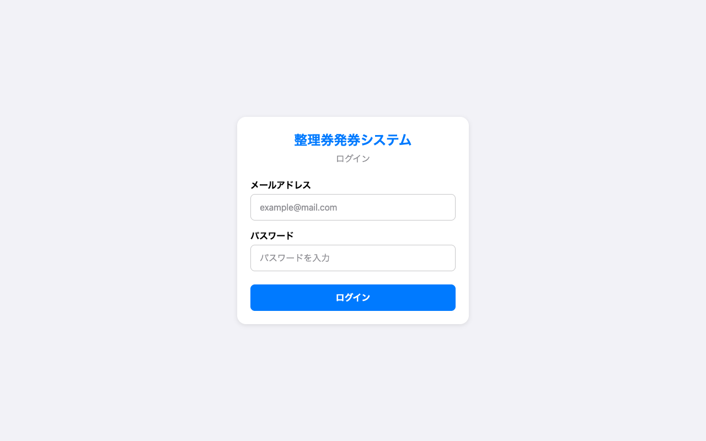

### ログインできない場合

- メールアドレスとパスワードが正しいか確認してください
- 大文字・小文字を間違えていないか確認してください
- 何度試してもログインできない場合は、システム部に連絡してください

---

## 3. 画面構成

### パソコンの場合

画面左側にサイドバーメニューがあり、以下のタブで切り替えます。

| タブ | 機能 |
|------|------|
| **企画管理** | 企画の登録・編集・削除・発券設定 |
| **発券** | 整理券の発行 |
| **呼び出し** | 整理券の呼び出し |
| **状況確認** | 発券状況の確認 |
| **デフォルト設定** | システム全体の基本設定 |

画面左下には、ログイン中のユーザー名と「ログアウト」ボタンが表示されます。

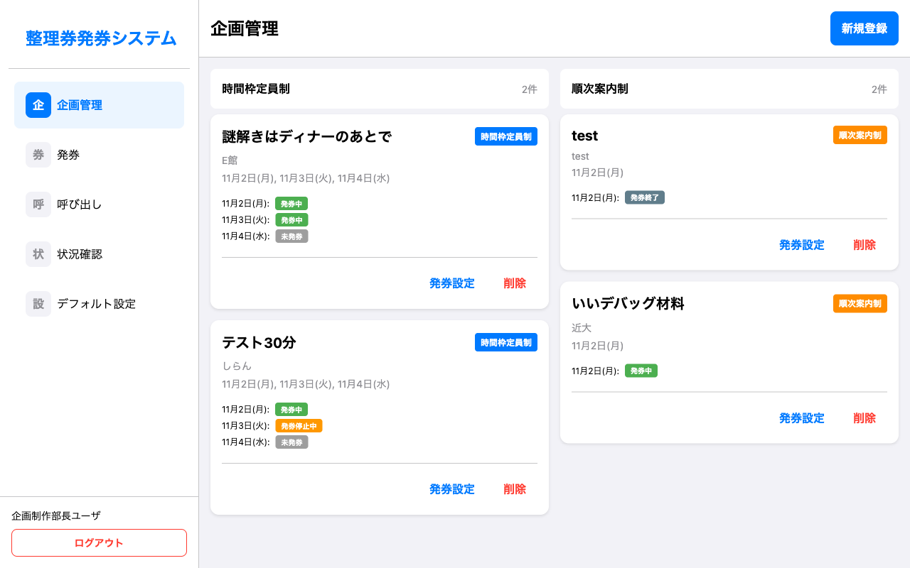

### スマートフォンの場合

画面下部にタブバーが表示されます（企画管理・発券・呼び出し・状況確認）。
デフォルト設定やログアウトは、左上のハンバーガーメニュー（三本線のアイコン）から操作します。

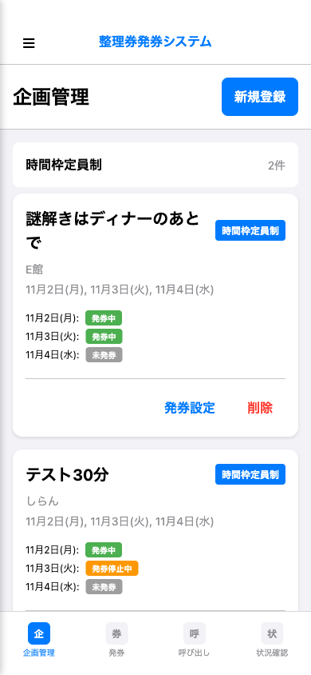

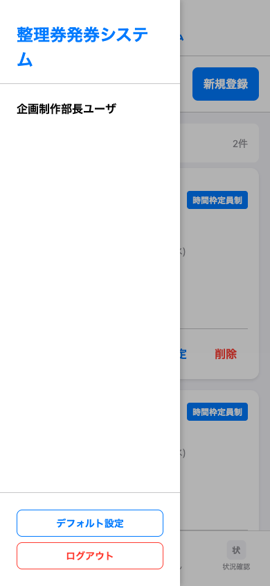

---

## 4. 企画管理

企画の登録・編集・削除・発券ステータスの管理を行います。

### 4.1 企画一覧を確認する

「企画管理」タブを開くと、登録済みの企画が一覧で表示されます。
企画は「時間枠定員制」と「順次案内制」の2つのカテゴリに分かれています。

各企画カードには以下の情報が表示されます。

- 企画名
- 企画タイプ（時間枠定員制 / 順次案内制）
- 開催場所
- 開催日
- 各開催日の発券ステータス

### 4.2 企画を新規登録する

1. 右上の「**新規登録**」ボタンを押します
2. 以下の情報を入力します

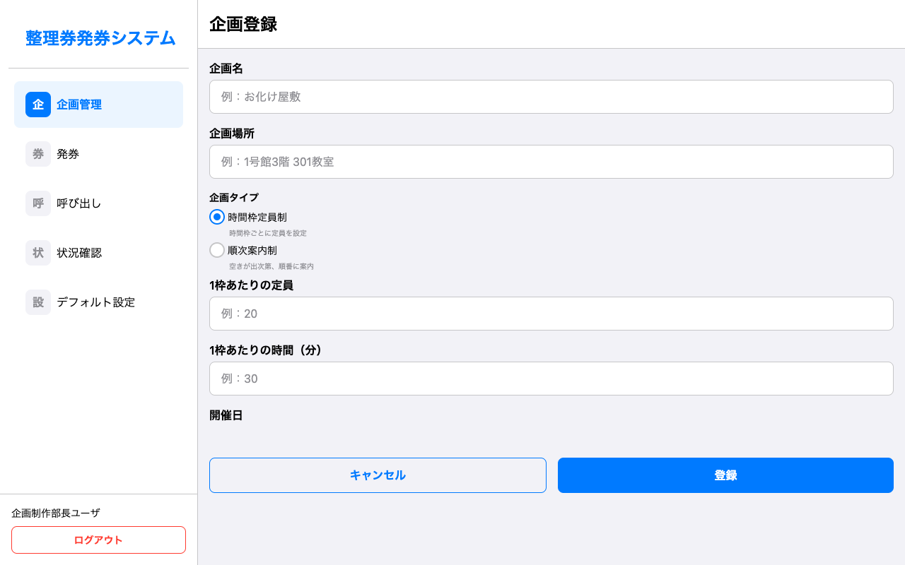

#### 入力項目

| 項目 | 説明 |
|------|------|
| 企画名 | 企画の名称を入力します（例：お化け屋敷） |
| 企画場所 | 開催場所を入力します（例：1号館3階 301教室） |
| 企画タイプ | 「時間枠定員制」または「順次案内制」を選択します |

#### 時間枠定員制の場合の追加入力

| 項目 | 説明 |
|------|------|
| 1枠あたりの定員 | 1つの時間枠に入れる最大人数（例：20） |
| 1枠あたりの時間（分） | 1つの時間枠の長さ（分単位、例：30） |

#### 順次案内制の場合の追加入力

| 項目 | 説明 |
|------|------|
| 1グループあたりの推定待ち時間（分） | 1グループが案内されるまでの目安時間（例：10） |

3. 開催日のチェックボックスで、実施する日を選択します
4. 必要に応じて各開催日の開始・終了時刻を調整します
5. 「**登録**」ボタンを押します

### 4.3 発券ステータスを変更する

企画一覧の各企画カードにある「**発券設定**」ボタンから、発券のステータスを変更できます。

#### ステータスの種類

| ステータス | 意味 | バッジの色 |
|-----------|------|-----------|
| **未発券** | まだ発券を開始していない状態 | グレー |
| **発券中** | 整理券を発行している状態 | 緑 |
| **発券停止中** | 一時的に発券を停止している状態（トラブル対応等） | オレンジ |
| **満員** | 定員に達した状態（自動で切り替わる） | 赤 |
| **発券終了** | 発券を終了した状態 | グレー |

> **自動ステータス変更について**
> - 時間枠定員制で定員に達した場合、自動的に「満員」になります
> - 時間枠の開始時刻を過ぎると、自動的に「発券終了」になります

### 4.4 企画を削除する

企画カードの「**削除**」ボタンを押すと、確認ダイアログが表示されます。
削除を実行すると、その企画に紐づく全てのデータ（整理券、時間枠など）も削除されます。

> **注意**: 削除は取り消しできません。本当に不要な場合のみ実行してください。

---

## 5. 発券

整理券を発行する機能です。紙媒体と電子媒体の2種類に対応しています。

### 5.1 発券する企画を選ぶ

1. 「**発券**」タブを開きます
2. 発券したい企画を選択します

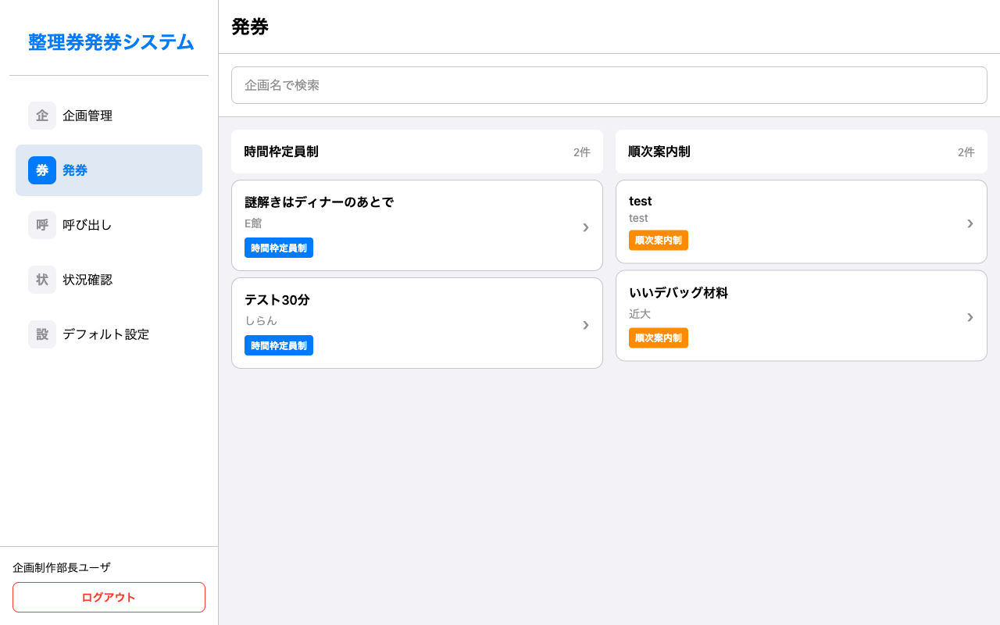

### 5.2 時間枠定員制の発券

1. 企画を選択すると、日付タブと時間枠一覧が表示されます
2. 発券したい**日付タブ**を選びます
3. 右側の時間枠一覧から、発券したい**時間枠**を選びます
   - 各時間枠には現在の発券数/定員が表示されます（例：12/20）
   - 満員の枠はグレーアウトされ、選択できません
4. **発行媒体**を選びます（紙 / 電子）
5. **発券枚数**を「-」「+」ボタンで調整します
6. 「**発券する**」ボタンを押します

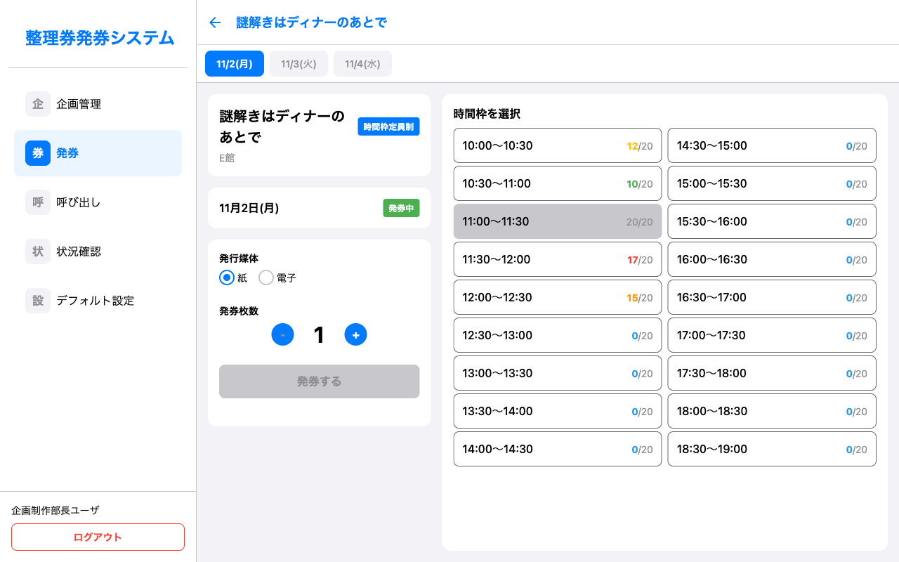

### 5.3 順次案内制の発券

1. 企画を選択すると、日付タブと発券・呼び出し状況が表示されます
2. 発券したい**日付タブ**を選びます
3. 右側に現在の状況が表示されます
   - **最後尾番号**: 最後に発券された整理番号
   - **現在の呼び出し番号**: 今呼び出されている番号
   - **推定待ち時間**: おおよその待ち時間（グループ数で計算）
4. **発行媒体**を選びます（紙 / 電子）
5. **発券枚数**を調整します
6. 「**発券する**」ボタンを押します

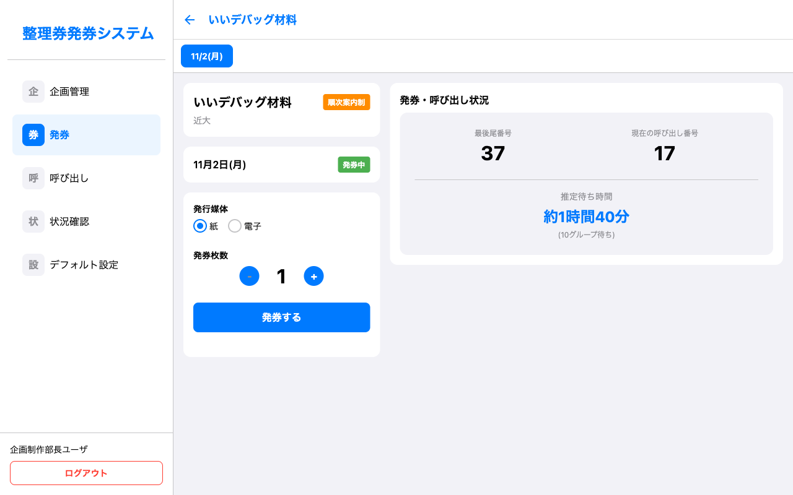

### 5.4 紙媒体の場合

発券すると画面に以下の情報が表示されます。

- 整理番号
- 時間枠（時間枠定員制の場合）
- 企画名
- 日付

**この画面をお客さんに見せて、対応する番号の紙の整理券を手渡してください。**

### 5.5 電子媒体の場合

発券すると画面に**QRコード**が表示されます。

1. お客さんにQRコードをスマートフォンで読み取ってもらいます
2. 読み取ると、整理券情報が表示される確認ページが開きます
3. お客さんのスマートフォンに整理券情報が保存されます

---

## 6. 呼び出し

発券した整理券の番号を呼び出す機能です。

### 6.1 呼び出す企画を選ぶ

1. 「**呼び出し**」タブを開きます
2. 呼び出したい企画を選択します

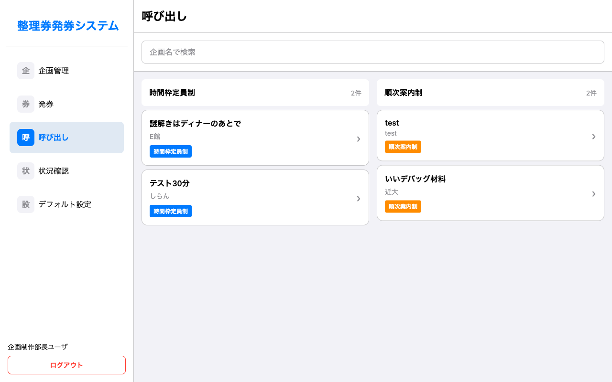

### 6.2 時間枠定員制の呼び出し

1. 日付タブを選びます
2. 呼び出す時間枠を選びます
3. 「**呼び出し**」ボタンを押します
4. 全画面で時間枠情報が表示されます（例：「10:30の回」）

### 6.3 順次案内制の呼び出し

1. 日付タブを選びます
2. 画面左側に**現在の呼び出し番号**が大きく表示されます
3. 画面右側に**発券グループ一覧**が表示されます
   - 「呼び出し済み」のグループには緑のバッジが付きます
   - 訂正したい場合は、呼び出し済みのグループをタップして「タップで訂正」を選べます
4. 呼び出したいグループを選択します
5. 「**呼び出し**」ボタンを押します
6. 全画面で「○番まで呼び出し中」と表示されます

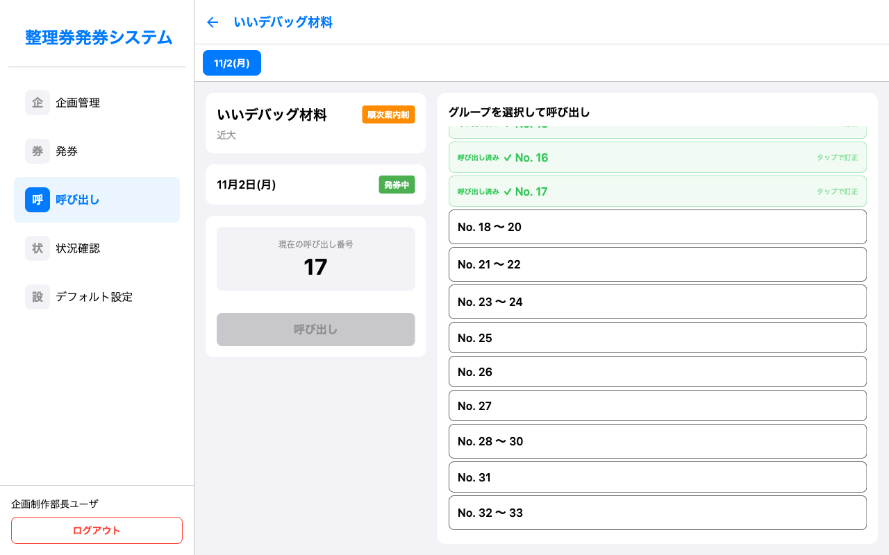

> **リアルタイム同期**: 呼び出し番号の更新は、他の端末にもリアルタイムで反映されます。複数の係員が同時に画面を確認できます。

### 6.4 発券グループについて

順次案内制では、1回の発券操作でまとめて発行された整理券を「発券グループ」として管理します。

- 1人発券 → 1グループ（例：No.1）
- 3人まとめ発券 → 1グループ（例：No.2 〜 4）

呼び出しはこのグループ単位で行います。

---

## 7. 状況確認

企画ごとの発券状況をリアルタイムで確認できます。

### 7.1 確認する企画を選ぶ

1. 「**状況確認**」タブを開きます
2. 確認したい企画を選択します

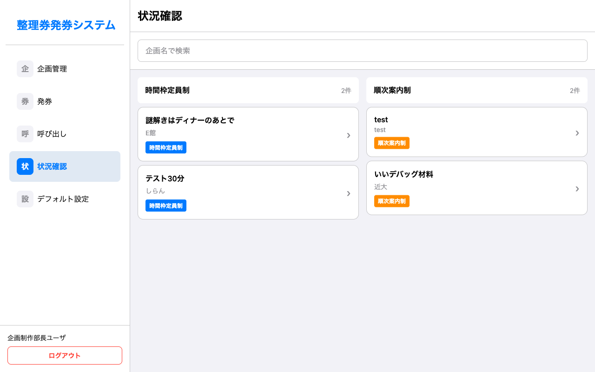

### 7.2 時間枠定員制の状況確認

時間枠ごとに以下の情報が表示されます。

- **時間枠**: 開始〜終了時刻
- **発券数 / 定員**: 現在の発券数と定員（例：12/20）
- **発券率（%）**: プログレスバーとパーセンテージ
- **ステータス**: 発券中、満員、発券終了 など

プログレスバーの色は発券率に応じて変化します。

| 発券率 | 色 |
|--------|-----|
| 低い | 緑 |
| 中程度 | 黄色 |
| 高い | オレンジ |
| 非常に高い / 満員 | 赤 |

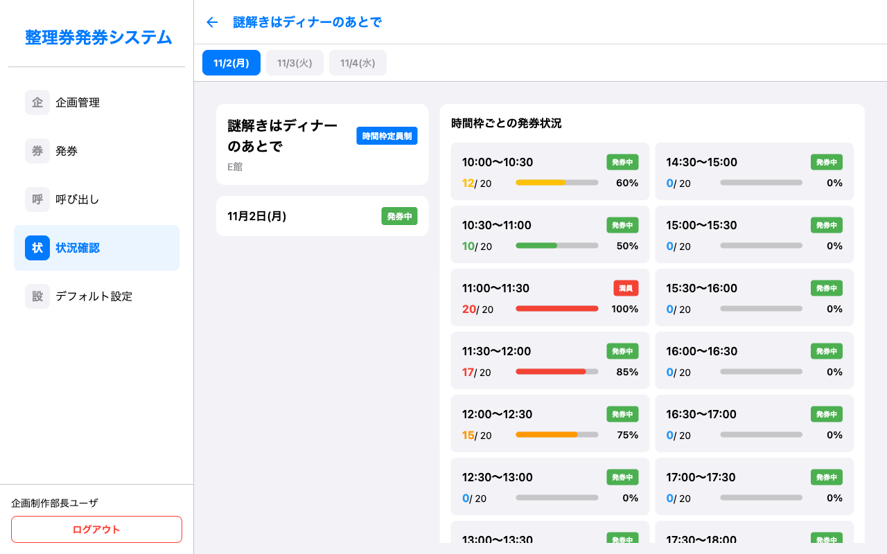

### 7.3 順次案内制の状況確認

以下の情報が表示されます。

- **最後尾番号**: 最後に発券された整理番号
- **現在の呼び出し番号**: 現在呼び出し中の番号
- **推定待ち時間**: おおよその待ち時間
- **待ちグループ数**: 現在待っているグループの数

---

## 8. デフォルト設定

システム全体の基本設定を管理します。ここで変更した内容は全ユーザーに反映されます。

### アクセス方法

- **パソコン**: サイドバーの「デフォルト設定」を選択
- **スマートフォン**: 左上のハンバーガーメニューから「デフォルト設定」を選択

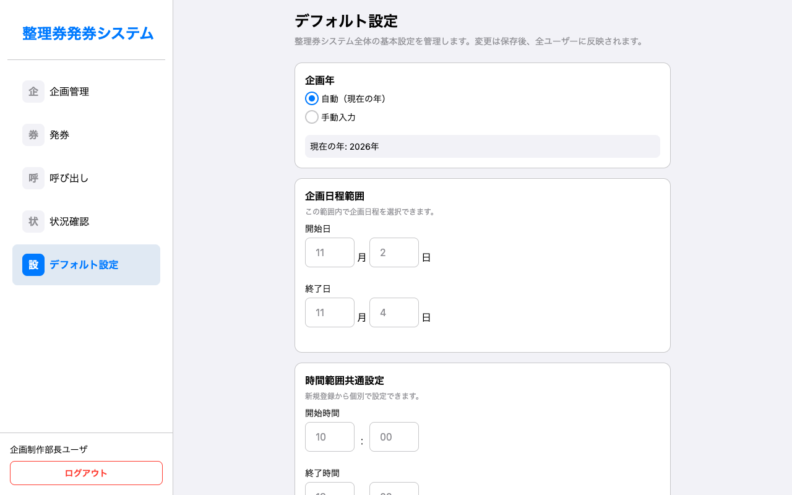

### 設定項目

#### 企画年

- **自動（現在の年）**: 現在の西暦を自動で使用します
- **手動入力**: 任意の年を入力できます

#### 企画日程範囲

企画の開催日の範囲を設定します。企画登録時に選べる開催日の範囲がここで決まります。

- **開始日**: 開催開始日（例：11月2日）
- **終了日**: 開催終了日（例：11月4日）

#### 時間範囲共通設定

時間枠定員制で新規登録する際の、デフォルトの時間範囲です。

- **開始時間**: 企画の開始時刻（例：10:00）
- **終了時間**: 企画の終了時刻（例：19:00）

> **補足**: 各企画の時間枠は、企画登録時に個別に調整できます。ここでの設定は初期値として使われます。

#### 配布率の閾値設定

状況確認画面のプログレスバーの色が変わる基準値を設定します。

| 閾値 | 意味 | 初期値 |
|------|------|--------|
| 低 | この値以下は緑色 | 25% |
| 中 | この値以下は黄色 | 50% |
| 高 | この値以下はオレンジ色 | 60% |
| 非常に高 | この値以上は赤色 | 80% |

設定を変更したら「**保存**」ボタンを押してください。

---

## 9. スマートフォンでの操作

スマートフォンでは、画面下部のタブバーで画面を切り替えます。

### タブバー

| タブ | 機能 |
|------|------|
| 企画管理 | 企画の一覧・登録・編集・削除 |
| 発券 | 整理券の発行 |
| 呼び出し | 整理券の呼び出し |
| 状況確認 | 発券状況の確認 |

### ハンバーガーメニュー

左上の「☰」アイコンをタップすると、スライドメニューが開きます。

- **ユーザー名**が表示されます
- 「**デフォルト設定**」ボタンで設定画面に移動できます
- 「**ログアウト**」ボタンでログアウトできます

メニューを閉じるには、メニュー外の暗くなった部分をタップします。

---

## 10. よくある質問（FAQ）

### Q. 同時に複数の端末で操作できますか？

**A.** はい、できます。複数の端末で同時にログインし、発券や呼び出しを行えます。呼び出し番号はリアルタイムで同期されます。発券時の整理番号の重複も、システムが自動で防止します。

### Q. 定員に達したらどうなりますか？

**A.** 時間枠定員制の場合、定員に達すると自動的に「満員」ステータスに変わり、その枠への発券ができなくなります。

### Q. 時間枠の開始時刻を過ぎたらどうなりますか？

**A.** 時間枠定員制の場合、時間枠の開始時刻を過ぎると自動的に「発券終了」になります。例えば11:20の時点で、10:00〜11:00の枠は「発券終了」ですが、11:00〜12:00の枠はまだ「発券中」のままです。

### Q. 発券を一時的に止めたい場合は？

**A.** 企画管理画面の「発券設定」ボタンから、ステータスを「発券停止中」に変更してください。再開する場合は「発券中」に戻します。

### Q. 電子整理券のQRコードが読み取れない場合は？

**A.** スマートフォンのカメラアプリまたはQRコードリーダーアプリで読み取ってください。それでも読み取れない場合は、紙媒体での発券に切り替えてください。

### Q. 呼び出し番号を間違えた場合は？

**A.** 順次案内制の場合、呼び出し画面で「呼び出し済み」のグループをタップすると訂正できます。確認ダイアログが表示されるので、訂正を確定してください。

### Q. 発券終了後でも呼び出しはできますか？

**A.** はい、できます。発券ステータスが「発券終了」や「発券停止中」でも、呼び出し操作は可能です。

### Q. デフォルト設定を変更したら既存の企画にも反映されますか？

**A.** いいえ、既存の企画には反映されません。デフォルト設定は新規企画登録時の初期値として使われます。既存の企画を変更したい場合は、個別に編集してください。

---

## 付録：画面一覧

| # | 画面名 | 説明 |
|---|--------|------|
| 1 | ログイン画面 | メールアドレスとパスワードでログイン |
| 2 | 企画管理一覧 | 登録済み企画の一覧表示 |
| 3 | 企画登録画面 | 新規企画の登録フォーム |
| 4 | 発券一覧 | 発券対象の企画を選択 |
| 5 | 発券詳細（時間枠定員制） | 時間枠を選んで発券 |
| 6 | 発券詳細（順次案内制） | 現在の状況を見ながら発券 |
| 7 | 呼び出し一覧 | 呼び出し対象の企画を選択 |
| 8 | 呼び出し詳細（順次案内制） | グループを選んで呼び出し |
| 9 | 状況確認一覧 | 状況確認する企画を選択 |
| 10 | 状況確認詳細（時間枠定員制） | 時間枠ごとの発券状況 |
| 11 | デフォルト設定 | システム全体の基本設定 |

---

*このマニュアルは2026年4月時点の情報に基づいています。*
